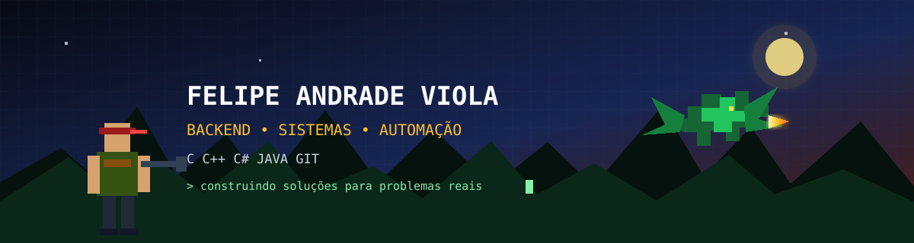

  

  <h1>Felipe Andrade Viola</h1>

  

  

    
    
  

## Sobre mim

Sou estudante do **3º período de Sistemas de Informação na Universidade Federal de Uberlândia (UFU)** e desenvolvedor em formação, com maior afinidade pelo **desenvolvimento backend**. Tenho conhecimentos em **C, C++, C# e Java**, além de experiência prática com algoritmos, orientação a objetos, estruturas de dados, ponteiros, recursão, structs e manipulação de arquivos.

Atualmente, amplio meus estudos em backend, Git e GitHub enquanto inicio minha formação em **desenvolvimento frontend**. Gosto de unir tecnologia, organização de processos e necessidades reais de negócios para projetar sistemas úteis, claros e mensuráveis.

Minha experiência profissional também envolve acompanhamento de qualidade, prazos, indicadores e melhoria contínua, competências que aplico na organização e no planejamento dos projetos de software.

## Tecnologias e ferramentas

  

| Área | Conhecimentos |
|---|---|
| Backend | C, C++, C#/.NET e Java |
| Fundamentos | Algoritmos, POO, estruturas de dados, recursão e arquivos |
| Frontend | HTML, CSS e JavaScript em aprendizado |
| Ferramentas | Git, GitHub, Visual Studio e VS Code |
| Interesses | APIs, bancos de dados, automação e sistemas de gestão |

## Projetos em desenvolvimento

### 🔎 Plataforma inteligente de ofertas e cupons

Sistema para captar ofertas publicadas na internet, comparar preços do mesmo produto em diferentes lojas e localizar cupons que reduzam o valor final da compra. A proposta é organizar informações dispersas e entregar ao usuário a melhor oportunidade considerando preço, desconto, frete e confiabilidade da loja.

Funcionalidades planejadas:

- coleta e atualização periódica de preços;
- identificação de produtos equivalentes em diferentes sites;
- aplicação e validação de cupons;
- histórico de preços para distinguir promoções reais;
- alertas personalizados por produto ou faixa de preço;
- painel administrativo para revisar ofertas e acompanhar acessos.

### 🍽️ Sistema integrado para restaurante

Solução para registrar pedidos diretamente no atendimento e enviá-los instantaneamente à cozinha. Cada pedido terá status de preparo, identificação da mesa e do garçom, observações do cliente e acompanhamento até a entrega e o fechamento da conta.

O painel gerencial deverá reunir vendas diárias, produtos mais pedidos, horários de maior movimento, tempo médio de preparo e desempenho da equipe. Também está previsto o registro de gorjetas e avaliações, permitindo reconhecer bons atendimentos e identificar pontos de melhoria sem transformar os indicadores em uma análise isolada do contexto.

### 🍷 Sistema de gestão para loja de vinhos

Plataforma para controlar estoque, vendas, preços, margens e desempenho comercial de uma loja especializada em vinhos. O sistema deverá acompanhar entradas e saídas por rótulo, avisar sobre estoque baixo e oferecer uma visão clara da receita e do lucro estimado.

Funcionalidades planejadas:

- catálogo por rótulo, vinícola, país, safra, uva e faixa de preço;
- controle de estoque e histórico de movimentações;
- metas mensais e projeção de vendas e lucro;
- ranking de produtos e categorias mais vendidos;
- acompanhamento de atendimentos e vendas por funcionário;
- relatórios para apoiar compras, promoções e decisões comerciais.

## Formação e cursos

### Formação acadêmica

- **Sistemas de Informação - UFU** — 3º período, em andamento
- **Inglês - CCAA** — concluído
- **Manutenção de Computadores - CEBRAC** — concluído

### Certificados

- [Programe seu Futuro: Programação com a Linguagem C - 53 horas](./certificados/certificado-programacao-c.pdf)
- [Todo Cálculo: Limite, Derivada e Integrais - 42,5 horas](./certificados/certificado-calculo.pdf)

### Em fase de conclusão

- [Java COMPLETO: Programação Orientada a Objetos + Projetos](https://www.udemy.com/course/java-curso-completo/)
- [Estruturas de Dados em C#](https://coddy.tech/landing/pt/csharp/topic/data-structures-courses)
- [Curso de C#](https://www.udemy.com/course/curso-c-sharp/)
- [Git e GitHub do básico ao avançado](https://www.udemy.com/course/git-e-github-do-basico-ao-avancado-c-gist-e-github-pages/)
- [Um primeiro curso direto de Álgebra Linear](https://www.udemy.com/course/um-primeiro-curso-direto-de-algebra-linear/)

## Estatísticas

  <picture>
    <source media="(prefers-color-scheme: dark)" srcset="https://github-readme-stats.vercel.app/api?username=FelipeAViola&show_icons=true&theme=codeSTACKr&hide_border=true&locale=pt-br" />
    
  </picture>
  <picture>
    <source media="(prefers-color-scheme: dark)" srcset="https://github-readme-stats.vercel.app/api/top-langs/?username=FelipeAViola&layout=compact&theme=codeSTACKr&hide_border=true&locale=pt-br" />
    
  </picture>

## Trilha de contribuições

  <picture>
    <source media="(prefers-color-scheme: dark)" srcset="https://raw.githubusercontent.com/FelipeAViola/FelipeAViola/output/github-contribution-grid-snake-dark.svg" />
    <source media="(prefers-color-scheme: light)" srcset="https://raw.githubusercontent.com/FelipeAViola/FelipeAViola/output/github-contribution-grid-snake.svg" />
    
  </picture>

---

  <strong>Aprendendo, construindo e evoluindo um projeto de cada vez.</strong>

